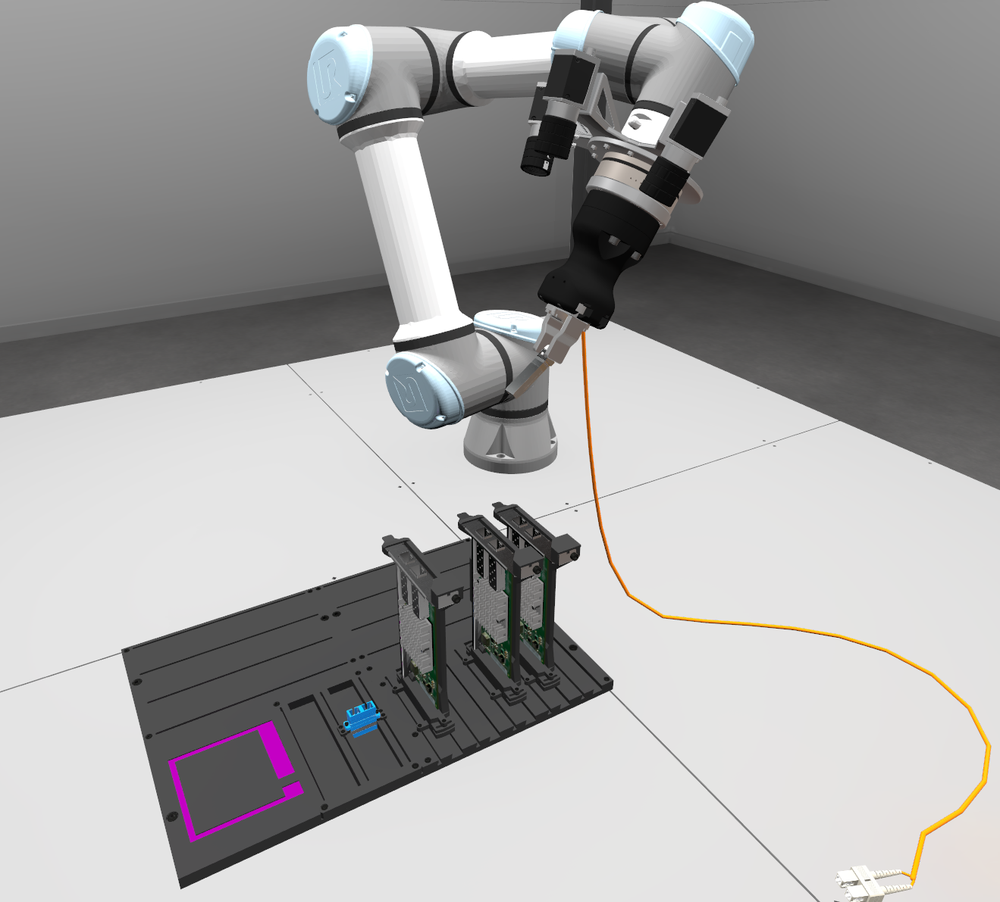
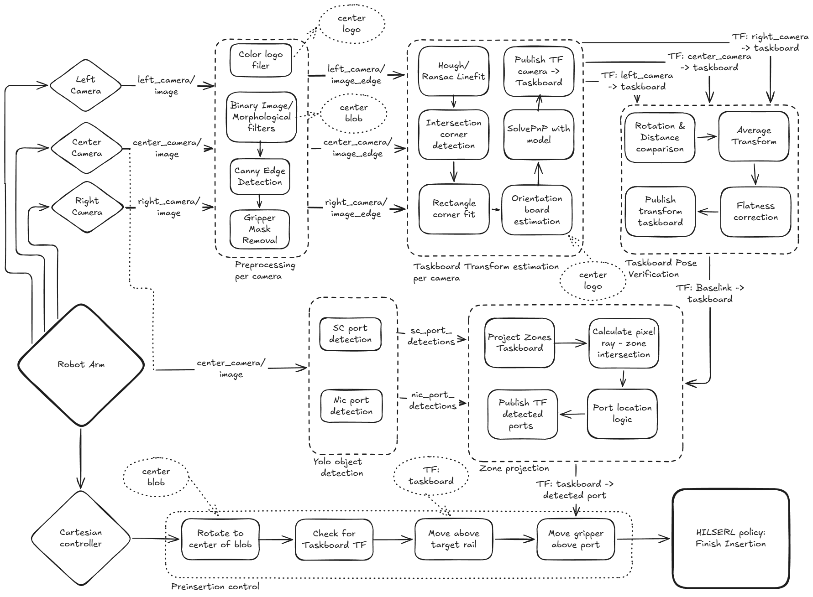
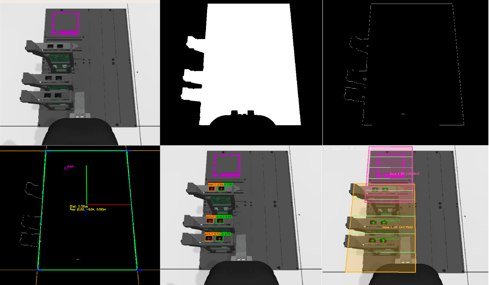
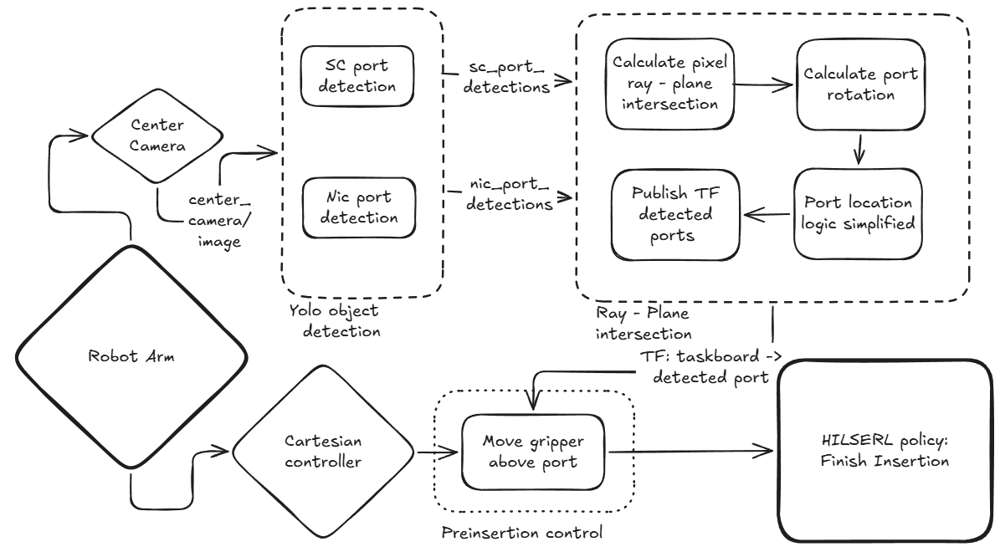

# AIC Preinsertion strategy

Qualifying-phase perception and preinsertion stack for the [AIC](https://github.com/intrinsic-dev/aic) task board. Two paths are supported:

- **Regular** — multi-camera board pose + YOLO ports + zone projection (diagram below)
- **Simple** — center-camera YOLO + table-plane ray intersection (no board pose)

ROS 2 **Kilted**, Gazebo **Ionic**, `rmw_zenoh_cpp`. Depth / RGB-D is not used in either path.



*Gazebo scene: AIC arm with wrist cameras over the task board (magenta logo, SC/NIC mounts).*

## Packages

| Package | Role |
| --- | --- |
| `aic_taskboard_detection` | Per-camera preprocessing (logo, blob, Canny, gripper mask), RANSAC/Hough + `solvePnP`, multi-camera `taskboard_tf_fusion` |
| `aic_component_detection` | YOLO (or HSV) SC/NIC detection, `zone_projection`, `simple_port_3d` |
| `aic_preinsertion_control` | Cartesian state machine (blob → rail → port); streams `pose_commands` to `aic_controller` |
| `aic_preinsertion_bringup` | Combined Zenoh + Gazebo + perception launches and `simulator.yaml` |
| `aic_perinsertion_utils` | Shared transform helpers |

## Regular pipeline

`ros2 launch aic_preinsertion_bringup aic_preinsertion_perception.launch.py`



How the diagram maps onto this repo:

| Diagram block | Implementation |
| --- | --- |
| Preprocessing per camera | `preprocessing` ×3 — color logo filter, binary/morph blob, Canny, gripper mask |
| Taskboard transform estimation per camera | `ransac_hough_taskboard_detection` ×3 — Hough/RANSAC lines → corners → `solvePnP` → TF `camera → taskboard_<cam>` |
| Taskboard pose verification | `taskboard_tf_fusion` — multi-camera consensus → TF `base_link → taskboard_detected` |
| YOLO object detection | `sc_port_detection` + `nic_port_detection` on the center camera |
| Zone projection | `zone_projection` — ray ∩ zone planes on the board → TF `taskboard_detected →` port frames |
| Preinsertion control | Separate launch: rotate to blob → wait for board TF → move above rail → move above port |
| HILSERL policy: Finish Insertion | **Not in this repo** — intended downstream insertion policy |

Topic / frame names in code (diagram labels in parentheses):

- Edges: `/{cam}_camera/image_canny` (`image_edge`)
- Logo / blob: `color_logo_center`, `blob_center` (center logo / center blob) — logo feeds orientation; **blob goes only to control**, not into RANSAC
- Fused board: `taskboard_detected` (`Baselink → taskboard`)
- Ports: `nic_port_r*_p*`, `sc_port_r*` under `taskboard_detected`

Startup is **event-gated**: Zenoh ready → Gazebo → arm controller spawner exit → preprocessing + taskboard detection → taskboard detection ready → component detection.

Example center-camera debug views along that chain (raw → blob → Canny → board pose / logo → NIC ports → SC/NIC zones):



## Simple pipeline

`ros2 launch aic_preinsertion_bringup aic_preinsertion_perception_simple.launch.py`



| Diagram block | Implementation |
| --- | --- |
| Center camera only | No left/right cameras, no preprocessing / board pose / fusion |
| YOLO object detection | Same `sc_port_detection` + `nic_port_detection` |
| Ray–plane intersection | `simple_port_3d` — pixel ray ∩ horizontal planes in `tabletop` (SC ≈ +0.03 m, NIC ≈ +0.15 m) |
| Preinsertion control (move gripper above port) | Intended use of the diagram; the shipped `preinsertion_control` still expects blob + `taskboard_detected` from the **regular** path |
| HILSERL policy | **Not in this repo** |

Note: the simple diagram labels the port TF as `taskboard → detected port`; `simple_port_3d` publishes under parent frame **`tabletop`**, with the same child names as zone projection (`nic_port_r*_p*`, `sc_port_r*`).

## Preliminaries

Tested on Ubuntu 24.04 WSL2 (Windows 11) with an NVIDIA RTX 5090.

Suggested end of `~/.bashrc`:

```bash
# GPU WSL2 handling
export LD_LIBRARY_PATH=/usr/lib/wsl/lib:$LD_LIBRARY_PATH
export MESA_D3D12_DEFAULT_ADAPTER_NAME=NVIDIA
export GALLIUM_DRIVER=d3d12
export JAX_COMPILATION_CACHE_DIR="$HOME/.cache/jax"
export XLA_PYTHON_CLIENT_ALLOCATOR=platform

# ROS 2
export RMW_IMPLEMENTATION=rmw_zenoh_cpp
export ZENOH_CONFIG_OVERRIDE='transport/shared_memory/enabled=false'
source ~/ws_aic/install/setup.bash
```

Then install:

* [ROS 2 Kilted desktop](https://docs.ros.org/en/kilted/Installation.html)
* The AIC toolbox ([source install](https://github.com/intrinsic-dev/aic/blob/main/docs/build_eval.md))

Build this repo **from the workspace root** (`~/ws_aic`), not from inside this package directory (avoid nesting `build/` / `install/` / `log/` here).

## Disclaimer

Developed with help of [Cursor](https://cursor.com/), mostly using Grok 4.6 as auto-selected model.

## Install this repository

```bash
git clone https://github.com/knmcguire/aic_taskboard_detection_qualifying_phase
cd ~/ws_aic
GZ_BUILD_FROM_SOURCE=1 colcon build \
  --cmake-args -DCMAKE_BUILD_TYPE=Release \
  --merge-install --symlink-install \
  --packages-select \
    aic_perinsertion_utils \
    aic_component_detection \
    aic_preinsertion_control \
    aic_taskboard_detection \
    aic_preinsertion_bringup
source install/setup.bash
```

## Try out the default strategy

### Combined perception bringup

```bash
ros2 launch aic_preinsertion_bringup aic_preinsertion_perception.launch.py
```

Useful launch arguments:

| Arg | Default | Meaning |
| --- | --- | --- |
| `simulator_config` | package `config/simulator.yaml` | Gazebo / task-board spawn |
| `start_zenoh` | `true` | Start `rmw_zenohd` in-process |
| `debug_viz` | `true` | Debug image topics (set `false` to save CPU / Zenoh bandwidth) |
| `continue_detecting` | `false` | Keep RANSAC running after the first fused lock |
| `camera_name` | `center` | Camera for SC/NIC + zone projection |
| `sc_method` | `yolo` | `yolo` or `hsv` for SC ports |

Task-board spawn (pose, which components are present) lives in `aic_preinsertion_bringup/config/simulator.yaml`.

Simple pipeline (center camera + YOLO + `simple_port_3d`, no board pose):

```bash
ros2 launch aic_preinsertion_bringup aic_preinsertion_perception_simple.launch.py
```

### Piecemeal startup

Zenoh router:

```bash
ros2 run rmw_zenoh_cpp rmw_zenohd
```

Simulation:

```bash
ros2 launch aic_bringup aic_gz_bringup.launch.py \
  ground_truth:=true start_aic_engine:=false spawn_task_board:=true \
  sc_port_0_present:=true sc_port_1_present:=true \
  nic_card_mount_4_present:=true nic_card_mount_2_present:=true \
  nic_card_mount_1_present:=true
```

Preprocessing (Canny / blob / logo):

```bash
ros2 launch aic_taskboard_detection preprocessing.launch.xml
```

Taskboard detection + fusion:

```bash
ros2 launch aic_taskboard_detection ransac_hough_taskboard_detection.launch.xml
```

SC/NIC detection + zone projection:

```bash
ros2 launch aic_component_detection component_detection.launch.xml debug_viz:=true
```

## Controlling the arm

With the **regular** perception stack running (blob + `taskboard_detected` + port TFs):

Keyboard teleop:

```bash
ros2 run aic_teleoperation cartesian_keyboard_teleop
```

Automatic preinsertion state machine (matches the regular diagram: blob → board TF → rail → port):

```bash
ros2 launch aic_preinsertion_control preinsertion_control.launch.xml
```

It streams `pose_commands` to `aic_controller`. Default NIC target TF: `nic_port_r2_p0`. Insertion itself is left to a downstream HILSERL policy (not launched here).

## Key configs

| File | Package | Contents |
| --- | --- | --- |
| `config/simulator.yaml` | `aic_preinsertion_bringup` | Robot/cable/board pose and component spawn flags |
| `config/preprocessing.params.yaml` | `aic_taskboard_detection` | Blob / Canny / gripper mask |
| `config/ransac_hough_taskboard_detection.params.yaml` | `aic_taskboard_detection` | Hough, RANSAC, PnP, board size |
| `config/taskboard_tf_fusion.params.yaml` | `aic_taskboard_detection` | Multi-camera consensus lock |
| `config/component_detection.params.yaml` | `aic_component_detection` | YOLO/HSV, zone offsets, `simple_port_3d` |
| `config/preinsertion_control.params.yaml` | `aic_preinsertion_control` | State machine targets and tolerances |

YOLO weights live under `aic_component_detection/model/` (`sc_port.pt`, `nic_port.pt`).
